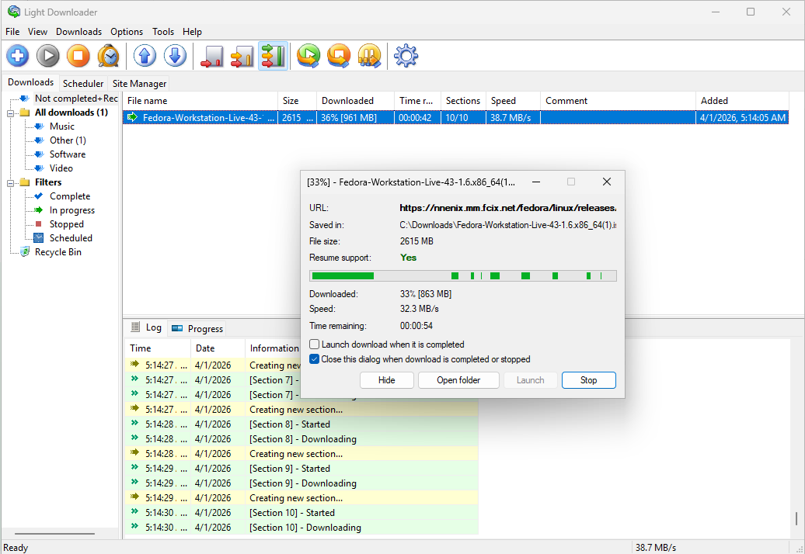

# Light Downloader

A lightweight, portable download manager for Windows with multi-part/segmented downloads.

Based on [Free Download Manager 3.9.7](https://sourceforge.net/p/freedownload/code/HEAD/tree/) via [FDM-UL](https://github.com/59de44955ebd/FDM-UL), modernized to C++20, Visual Studio 2022, [libcurl](https://curl.se/) and [pugixml](https://pugixml.org/).



## Building

Requires Visual Studio 2022 with C++ MFC for v143 build tools.

```
msbuild LightDownloader.sln /p:Configuration=Release /p:Platform=Win32
```

## License

GNU General Public License v3.0
